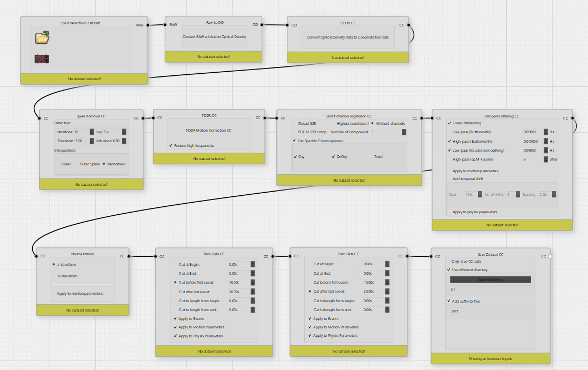

# fNIRS Preprocessing Pipeline (Satori Workflow)

This folder contains the complete fNIRS preprocessing workflow used to transform raw data into preprocessed data (BIDS derivatives). The pipeline was built and executed in **Satori** (v2.2.4).

---

## 📐 Preprocessing Workflow Overview

The raw intensity fNIRS data undergoes conversion to optical density (OD), concentration changes via the Modified Beer-Lambert Law (MBLL), motion artifact correction, systemic noise regression, frequency filtering, normalization, and data trimming.

---

## ⚙️ Step-by-Step Processing Pipeline

### 1. Data Import & Conversion
* **Load RAW fNIRS Dataset (`fNIRSLoadRAWModel`):** Imports raw light intensity data.
* **Raw to Optical Density (`fNIRSIORawToODModel`):** Converts raw intensity values to optical density changes ($\Delta \text{OD}$).
* **OD to Concentration (`fNIRSIOODToConcentrationModel`):** Applies the Modified Beer-Lambert Law (MBLL) to compute oxygenated ($\Delta[\text{HbO}]$) and deoxygenated ($\Delta[\text{HbR}]$) hemoglobin concentration changes.

### 2. Motion Artifact Correction & Noise Reduction
* **Spike Removal (`fNIRSSpikeRemovalCCModel`):**
  * **Threshold:** $3.5$
  * **Lag:** $5.0\text{ s}$ | **Influence:** $0.50$ | **Iterations:** $10$
  * **Interpolation:** Monotonic cubic interpolation
* **TDDR Motion Correction (`fNIRSTDDRCCModel`):** Applies Temporal Derivative Distribution Repair (TDDR) to eliminate baseline shifts and movement spikes while preserving high frequencies (`restoreHF = true`).

### 3. Nuisance Signal & Physiological Filtering
* **Short Channel Regression (`fNIRSIOGLMSSRModel`):** Removes superficial scalp hemodynamics using all available short-separation channels (GLM-SSR; $1$ PCA component) applied to both Oxy ($\text{HbO}$) and Deoxy ($\text{HbR}$) chromophores.
* **Temporal Filtering (`fNIRSIOFilteringModel`):**
  * **High-Pass Filter:** Butterworth at $0.01\text{ Hz}$
  * **Low-Pass Filter:** Gaussian smoothing / Butterworth at $0.09\text{ Hz}$
  * **Linear Detrending:** Enabled

### 4. Normalization & Trimming
* **Normalization (`fNIRSIONormalizationModel`):** Applies $z$-standardization ($z$-transform) across time channels.
* **Data Trimming (`fNIRSTRIMDataCCModel`):**
  * Trims $10.0\text{ s}$ before the first trigger event.
  * Trims $20.0\text{ s}$ after the last trigger event.

### 5. Output Export
* **Save Dataset (`fNIRSCCSaveModel`):** Exports preprocessed concentration data (`.snirf` / derivatives) appending the `_PPT` suffix.

---

## 📁 Files in this Directory

* **`satori_preprocessing_graph.png`**: Visual diagram of the Satori processing pipeline.
* **`satori_preprocessing_workflow.flow`**: The exact Satori workflow .flow file to reproduce these preprocessing steps in Satori.